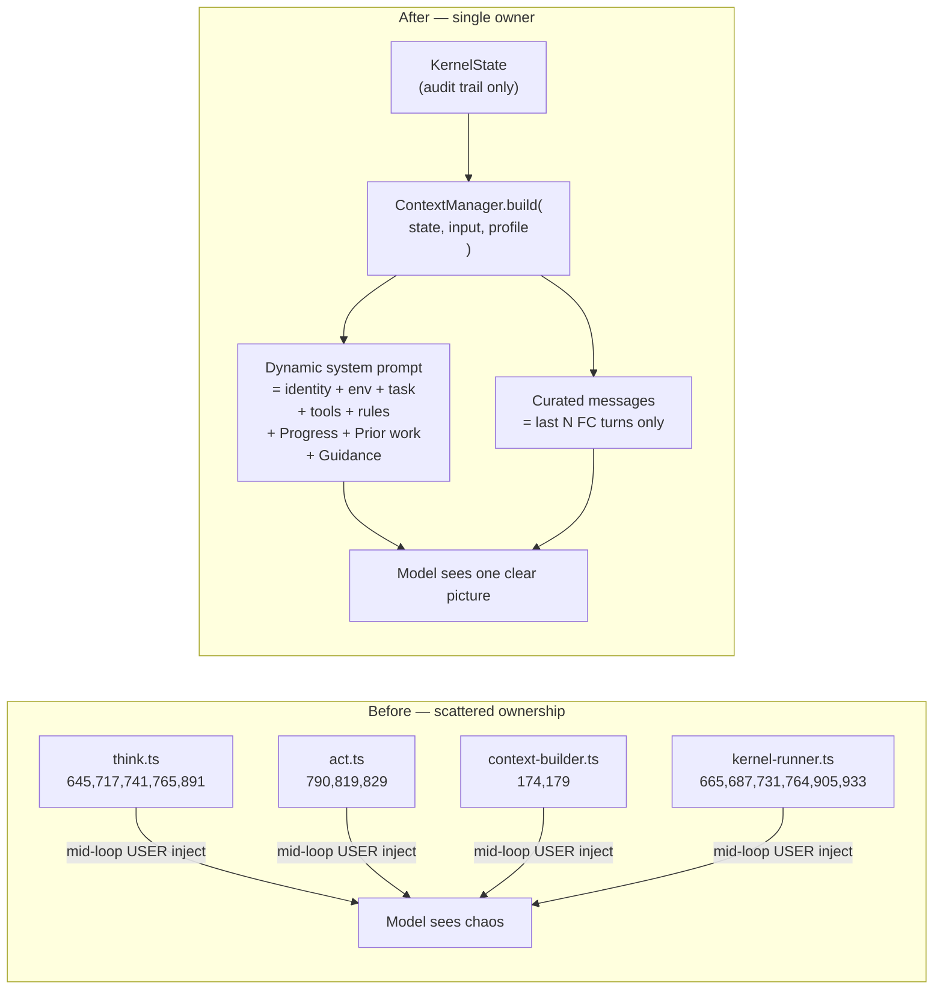

# Context Architecture Overhaul

## The Core Problem (and Why Previous Fixes Didn't Hold)

The harness has been accumulating band-aids because there was no single owner of context. Every phase (`think.ts`, `act.ts`, `kernel-runner.ts`, `context-builder.ts`) independently decided to inject guidance into the message array whenever it detected a problem. The result is 9 separate USER injection sites firing unpredictably, tool results appearing twice, and a model that sees a chaotic stream of competing instructions rather than a clean, purposeful conversation.

The nudges and compensation messages were trying to fix real problems:

- Model not calling required tools → quota nudge at `kernel-runner.ts:665`
- Tool failures → recovery nudge at `kernel-runner.ts:687`
- ICS synthesis decision → steering nudge at `kernel-runner.ts:731`
- Loop detected → loop nudge at `kernel-runner.ts:905`

**These signals are correct. The delivery is wrong.** Injecting mid-loop USER messages means the model sees guidance after it has already started composing a response, the guidance looks like user input rather than harness instruction, and there is no coordination between injection sites — they fire independently and can conflict.

The fix is not to remove the signals. It is to route all of them through a single, deliberate channel: the system prompt, rebuilt fresh each iteration to reflect the actual state of the task.

---

## Architectural Principle: ContextManager as First-Class System



**`ContextManager` is a pure function, not a service with side effects:**

```typescript
// packages/reasoning/src/context/context-manager.ts
export interface ContextManagerOutput {
  systemPrompt: string;
  messages: ConversationMessage[];
}

export interface GuidanceContext {
  requiredToolsPending: string[];
  loopDetected: boolean;
  icsGuidance?: string;
  oracleGuidance?: string;
  errorRecovery?: string;
}

export const ContextManager = {
  build(
    state: KernelState,
    input: KernelInput,
    profile: ContextProfile,
    guidance: GuidanceContext,
    calibration?: ModelCalibration,   // optional — tunes profile values, not required
  ): ContextManagerOutput
};
```

This function is **fully unit-testable with mock state**. Tests can assert exact system prompt content, exact message counts, exact token budgets — without running an LLM. This is the quality gate for context correctness going forward.

Calibration (`ModelCalibration`) is an **optional parameter** that tunes values like `toolResultMaxChars`, `keepRecentTurns`, and `systemPromptStyle`. Without it, `ContextManager` uses tier-based defaults from `ContextProfile`. The system must perform correctly on tier defaults alone — calibration makes it better, not possible.

---

## How the Nudges Translate (Signal Preserved, Channel Changed)

Every signal the nudges were sending moves into `GuidanceContext`, which `ContextManager` renders into the `Guidance:` section of the system prompt. The **detection logic in `kernel-runner.ts` does not change** — only the delivery changes from `transitionState({ steeringNudge })` to populating a `GuidanceContext` struct passed to `ContextManager.build()`.

| Old nudge              | Detection site             | Old delivery            | New delivery                                                     |
| ---------------------- | -------------------------- | ----------------------- | ---------------------------------------------------------------- |
| Required tool missing  | `kernel-runner.ts:665,933` | mid-loop USER message   | `Progress:` section: "Required: final-answer (pending)"          |
| Tool failure recovery  | `kernel-runner.ts:687`     | mid-loop USER message   | `Guidance:` section: "Tool X failed. Try Y."                     |
| ICS synthesis decision | `kernel-runner.ts:731`     | mid-loop USER message   | `Guidance:` section: ICS result string                           |
| Oracle gate redirect   | `kernel-runner.ts:764`     | mid-loop USER message   | `Guidance:` section: "Coverage complete. Call final-answer."     |
| Loop detection         | `kernel-runner.ts:905`     | mid-loop USER message   | `Guidance:` section: "Repeated calls detected. Change approach." |
| act.ts progress        | `act.ts:790`               | end-of-act USER message | `Progress:` section next iteration                               |
| act.ts finish          | `act.ts:819`               | end-of-act USER message | `Progress:` section next iteration                               |

The `Progress:` section is always present — the model sees required-tool status at the **start** of every generation, not reactively mid-loop. This is strictly better for compliance.

---

## What the Model Sees (Before vs After)

**Before — iteration 2 of a 4-tool research task:**

```
System: [static 180 tokens — same as iteration 1]

Messages (12):
  USER: "Find XRP, ETH, BTC, XLM prices"
  ASSISTANT: [thought + 4 tool_use calls]
  TOOL: "[web-search compressed preview]\n  — full text is stored. Use recall(\"result_1\") to retrieve..."
  TOOL: "[web-search compressed preview]\n  — full text is stored. Use recall(\"result_2\") to retrieve..."
  TOOL: "[web-search compressed preview]\n  — full text is stored. Use recall(\"result_3\") to retrieve..."
  TOOL: "[web-search compressed preview]\n  — full text is stored. Use recall(\"result_4\") to retrieve..."
  USER: "[Auto-forwarded: result_1]: <full 400 char dump>"
  USER: "[Auto-forwarded: result_2]: <full 400 char dump>"
  USER: "[Auto-forwarded: result_3]: <full 400 char dump>"
  USER: "[Auto-forwarded: result_4]: <full 400 char dump>"
  USER: "You must still call: final-answer"
  USER: "Required tools satisfied: web-search..."
```

**After — same iteration:**

```
System: [80 tokens]
  You are a reasoning agent. Use tools to complete tasks precisely.
  Environment: Mon Apr 14 2026
  Task: Find the current price of XRP, ETH, BTC, XLM.
  Tools: web-search(query), final-answer(answer)
  Rules: 1. Call independent tools in parallel. 2. Do not fabricate data.
  Progress: [2/6] Called web-search ×4. Required: final-answer (pending).
  Prior work: XRP $1.33 · ETH $1,581 · BTC $63,450 · XLM $0.093
  Guidance: All prices collected. Call final-answer now.

Messages (5):
  ASSISTANT: [thought + 4 tool_use calls]
  TOOL: "XRP: $1.33 (Kraken), $1.327 (Revolut)"
  TOOL: "ETH: $1,581.20 (CoinGecko)"
  TOOL: "BTC: $63,450 (Binance)"
  TOOL: "XLM: $0.093 (CoinMarketCap)"
```

Five messages. No duplicates. No recall hints. No competing USER messages. The model has one clear picture built by one system.

---

## Phase 0a: Wire modelId Through the Kernel

**The gap:** `modelId` flows into `meta.entropy.modelId` at `kernel-state.ts:351` but `KernelInput` (lines 129–219) has no `modelId` field and `selectAdapter` never receives it.

- Add `modelId?: string` to `KernelInput` in [`kernel-state.ts`](packages/reasoning/src/strategies/kernel/kernel-state.ts)
- In [`reactive.ts`](packages/reasoning/src/strategies/reactive.ts): populate `KernelInput.modelId` from the same source as the entropy seed
- [`think.ts:165`](packages/reasoning/src/strategies/kernel/phases/think.ts) and [`act.ts:192`](packages/reasoning/src/strategies/kernel/phases/act.ts): `selectAdapter(caps, profile.tier)` → `selectAdapter(caps, profile.tier, input.modelId)`
- [`think.ts:416`](packages/reasoning/src/strategies/kernel/phases/think.ts): `model: "unknown"` → `model: input.modelId ?? "unknown"`

Independent of all other phases. Zero behavior change — just plumbing that unlocks adapter lookup by modelId for Phase 6.

---

## Phase 1: Dead Code Removal

All removals confirmed zero production callers via audit.

**Delete entirely:**

- [`packages/reasoning/src/context/compaction.ts`](packages/reasoning/src/context/compaction.ts)
- [`packages/reasoning/src/context/context-budget.ts`](packages/reasoning/src/context/context-budget.ts)
- Their test files

**Remove from [`context-engine.ts`](packages/reasoning/src/context/context-engine.ts):**

- `buildDynamicContext` (275–333), `buildCompletedSummary` (394–415), `buildIterationAwareness` (420–429)
- `scoreContextItem` (120–140), `computeKeywordOverlap` (146–156), `allocateContextBudget` (174–217)

**Remove from [`message-window.ts`](packages/reasoning/src/context/message-window.ts):**

- `applyMessageWindow` (69–98) + helpers `estimateTokens`, `groupTurns`, `summarizeTurns` (13–61)
- Merge duplicate `FULL_TURNS_BY_TIER` / `KEEP_FULL_TURNS_BY_TIER` into one constant

**Remove from [`context-profile.ts`](packages/reasoning/src/context/context-profile.ts):**

- `promptVerbosity`, `rulesComplexity`, `fewShotExampleCount` — no production reads
- `compactAfterSteps`, `fullDetailSteps` — only used by deleted `buildDynamicContext`
- `contextBudgetPercent` — only used by deleted `applyMessageWindow`

**Clean barrels:** [`context/index.ts`](packages/reasoning/src/context/index.ts) lines 22–45 and [`reasoning/src/index.ts`](packages/reasoning/src/index.ts) lines 104–105, 118.

---

## Phase 2: Single Tool Result Path

Remove the 3-system overlap (compress+scratchpad, extractObservationFacts, auto-forward) and replace with one clean path branched by `profile.tier`:

- `local` tier: heuristic extraction → `tool_result.content` = clean facts, no scratchpad, no recall hints
- `mid` / `large` / `frontier`: `compressToolResult` → `tool_result.content` = preview + single recall hint (if result is large)

Calibration can override this via `calibration.observationHandling` when provided.

**Changes:**

- [`think.ts`](packages/reasoning/src/strategies/kernel/phases/think.ts) **lines 190–233**: delete entire `autoForwardSection` block and constants; remove parameter from `buildConversationMessages` call at line 276
- [`context-builder.ts`](packages/reasoning/src/strategies/kernel/phases/context-builder.ts) **line 174**: remove auto-forward USER injection
- [`act.ts`](packages/reasoning/src/strategies/kernel/phases/act.ts): route observation handling by `profile.tier` with clean `if/else` branches replacing tier-heuristic soup
- [`tool-execution.ts`](packages/reasoning/src/strategies/kernel/utils/tool-execution.ts): replace stacked 6-regex cleanup with single deterministic path per branch

---

## Phase 3: ContextManager + Dynamic System Prompt + Curated Messages

This is the architectural centerpiece. Everything the model sees comes from one function call.

**New file: [`packages/reasoning/src/context/context-manager.ts`](packages/reasoning/src/context/context-manager.ts)**

`ContextManager.build(state, input, profile, guidance, calibration?)` produces:

1. **Dynamic system prompt** (rebuilt every iteration):
   - `identity`: 1 line, tuned by `profile.tier` (terse for local, more explicit for mid)
   - `environment`: date/time
   - `task`: the task text — **removed from `messages[0]`** (no more duplication)
   - `tools`: schema at `profile.toolSchemaDetail` detail level
   - `rules`: tier-tuned rule count (fewer for local, more for large)
   - `Progress:` — `[iteration N/M] Called: X×4 (✓✓✓✓). Required: Y (pending).`
   - `Prior work:` — facts distilled from completed observation steps (heuristic, no LLM call required)
   - `Guidance:` — rendered from `GuidanceContext`: required-tool alerts, loop detection, ICS result, oracle gate, error recovery

2. **Curated message array**:
   - Last N FC turns (N = `profile.toolResultMaxChars`-aware tier default: `local`=2 turns, `mid`=4, `large`=6)
   - `state.messages` is the **immutable audit trail** — never compacted, only appended
   - `applyMessageWindowWithCompact` remains as an **emergency token guard** (last line of defense, rarely fires)

**`think.ts` change:** replace the entire system prompt assembly block (lines 150–188) and `buildConversationMessages` call (276–278) with a single `ContextManager.build()` call.

**`execution-engine.ts:1457`:** remove `messages[0]` USER seed — task lives in system prompt.

**Testability:** `ContextManager.build()` is a pure function. Unit tests can assert:

- Required-tool pending → `Progress:` contains tool name
- Loop detected → `Guidance:` contains loop message
- 4 recent turns → messages array has exactly 9 entries (ASSISTANT + 4 TOOL × 2 iterations)

---

## Phase 4: Unify All Guidance Into GuidanceContext

Remove `steeringNudge` from `KernelState` entirely. Replace with a `GuidanceContext` struct assembled at the top of `think.ts` each iteration from kernel state signals, then passed into `ContextManager.build()`.

**steeringNudge write sites removed from [`kernel-runner.ts`](packages/reasoning/src/strategies/kernel/kernel-runner.ts):**

| Line | Signal                    | Routes to                       |
| ---- | ------------------------- | ------------------------------- |
| 665  | Required tool quota       | `guidance.requiredToolsPending` |
| 687  | Tool failure recovery     | `guidance.errorRecovery`        |
| 731  | ICS steering              | `guidance.icsGuidance`          |
| 764  | Oracle gate               | `guidance.oracleGuidance`       |
| 905  | Loop detection            | `guidance.loopDetected = true`  |
| 933  | Required tool (loop path) | `guidance.requiredToolsPending` |

**Ad-hoc USER injection sites removed:**

| File                 | Lines              | Moves to                                                 |
| -------------------- | ------------------ | -------------------------------------------------------- |
| `think.ts`           | 645                | `guidance.requiredToolsPending`                          |
| `think.ts`           | 717, 741, 765, 891 | `guidance.icsGuidance` / `guidance.oracleGuidance`       |
| `context-builder.ts` | 179–180            | deleted with `steeringNudge`                             |
| `act.ts`             | 790, 819, 829      | `guidance.requiredToolsPending` + `guidance.icsGuidance` |

**Kept:** `think.ts:441` (`max_tokens` recovery) — legitimate re-run trigger, stays as USER message with `[Harness]:` prefix.

After Phase 4, there are exactly two sources of USER messages: `tool_result` FC protocol messages and `max_tokens` recovery.

---

## Phase 6 (Optional Enhancement): Calibration System

After Phases 0a–4 ship and the framework is stable, calibration can be layered in as a parameter enhancement — **not a prerequisite**.

- New file: `packages/llm-provider/src/calibration-types.ts` — `ModelCalibration` schema with measured fields (`observationHandling`, `effectiveContextWindow`, `optimalToolResultChars`, `compiledHooks`, etc.)
- `calibration-runner.ts` — 6-probe suite at `temperature=0`, averages N runs, writes JSON to `src/calibrations/<modelId>.json`
- `selectAdapter()` upgrade: check `src/calibrations/<modelId>.json` first, fall back to tier
- `ContextManager.build()` already accepts `calibration?` — it simply overrides profile defaults with measured values when present
- Pre-bake JSONs for: `gemma4.e4b`, `llama3.2.3b`, `qwen2.5-coder.7b`, `mistral-nemo`, `deepseek-r1.7b`
- CLI: `bun run calibrate --model <id> [--runs N] [--commit]`

The framework works identically with or without calibration. A missing calibration profile is not an error — it uses tier defaults. A present calibration profile makes those defaults better without changing the architecture.

---

## Execution Order

```
Phase 0a ──────────────────────────── modelId wiring (independent, low risk)
Phase 1  ──────────────────────────── dead code removal (independent, low risk)
         │
Phase 2  ── after 1 ─────────────── single tool result path (medium risk, big win)
         │
Phase 3  ── after 1 + 2 ──────────── ContextManager + dynamic prompt + curated messages
         │
Phase 4  ── after 3 ──────────────── unify guidance into GuidanceContext, remove steeringNudge
         │
Phase 5  ── after 4 ──────────────── full suite verification + end-to-end probe
         │
Phase 6  ── after 5, independent ─── calibration system (optional, no deadline)
```

Phases 0a and 1 are pure wins with no behavior change. Phase 2 fixes the immediate output quality regression. Phases 3–4 complete the architecture. Phase 6 is additive and can ship whenever it's ready.

---

## Files Touched Summary

| Package             | Files changed                                                                                                                                                 |
| ------------------- | ------------------------------------------------------------------------------------------------------------------------------------------------------------- |
| `reasoning/context` | `context-engine.ts`, `context-profile.ts`, `message-window.ts`, `context/index.ts`; new `context-manager.ts`; **delete** `compaction.ts`, `context-budget.ts` |
| `reasoning/kernel`  | `kernel-state.ts`, `kernel-runner.ts`, `phases/think.ts`, `phases/act.ts`, `phases/context-builder.ts`, `utils/tool-execution.ts`                             |
| `runtime`           | `execution-engine.ts` (task seed removal)                                                                                                                     |
| `reasoning/src`     | `index.ts` (barrel cleanup)                                                                                                                                   |
| `llm-provider`      | `adapter.ts` (Phase 0a + Phase 6); new `calibration-types.ts`, `calibration-runner.ts`, `calibrations/*.json` (Phase 6 only)                                  |
