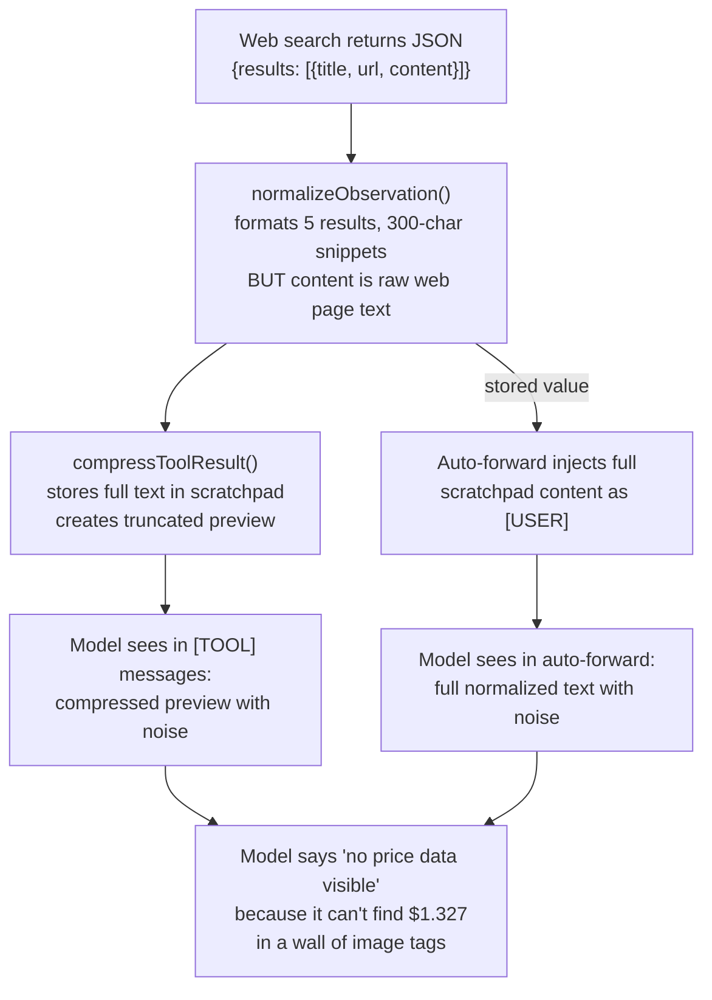

# Fix Reactive Strategy Output Quality

## Root Cause Chain

The failure is a **signal-to-noise ratio collapse** in the data the model sees. Here is the exact chain:



The `content` field from web search results contains raw web page markdown:

```
. [` ([tool-execution.ts:236-246](packages/reasoning/src/strategies/kernel/utils/tool-execution.ts)) into both the compressed preview AND the scratchpad (auto-forwarded data). The 300-char snippet budget is wasted on image tags instead of prices.

Three additional failures compound this:

1. **`observationSummary` is not set** in `scratch.ts`, so `shouldExtract = false` ([act.ts:194-196](packages/reasoning/src/strategies/kernel/phases/act.ts)) -- the existing LLM fact extraction never fires
2. **Even when extraction fires, facts are PREPENDED not REPLACING** ([act.ts:520](packages/reasoning/src/strategies/kernel/phases/act.ts)): `obsContent = extracted + "\n" + rawNoise` -- the noise stays
3. **Quality gate passes garbage** because the output mentions entity names ("XRP", "XLM") even though it says "no price data found" for each

---

## Fix 1: Clean web content at the source (zero LLM calls)

Add a `cleanWebSnippet()` function in [tool-execution.ts](packages/reasoning/src/strategies/kernel/utils/tool-execution.ts) and apply it inside `normalizeObservation()` BEFORE the `snippet.slice(0, 300)` truncation.

This cleans both the compressed preview AND the stored scratchpad content (both derive from `normalizeObservation` output).

```typescript
function cleanWebSnippet(text: string): string {
  return (
    text
      // Strip markdown images entirely: 
      .replace(/!\[[^\]]*\]\([^)]*\)/g, "")
      // Simplify markdown links: [text](url) -> text
      .replace(/\[([^\]]+)\]\([^)]*\)/g, "$1")
      // Strip leftover image references: ![...] without url
      .replace(/!\[[^\]]*\]/g, "")
      // Strip HTML-style image tags
      .replace(/]*>/gi, "")
      // Collapse multiple spaces/newlines
      .replace(/[ \t]{2,}/g, " ")
      .replace(/\n{3,}/g, "\n\n")
      .trim()
  );
}
```

Apply in `normalizeObservation` at line 241:

```typescript
const snippet = cleanWebSnippet(r.content?.trim() ?? "");
return snippet ? `${header}\n   ${snippet.slice(0, 300)}` : header;
```

**Impact**: The XRP result goes from:

```
 []...
```

To:

```
The price of XRP has decreased today. 1 XRP currently costs $1.327, which represents a change of +0.20% in the last hour...
```

The 300-char budget is now ALL data, zero noise.

## Fix 2: Default `observationSummary` to "auto" for local/mid tiers

In [act.ts:194-196](packages/reasoning/src/strategies/kernel/phases/act.ts), change the default so local/mid models automatically get LLM fact extraction when results exceed the compression budget:

```typescript
const obsMode = input.observationSummary;
const shouldExtract =
  obsMode === true ||
  (obsMode !== false && (profile.tier === "local" || profile.tier === "mid"));
```

The change: when `obsMode` is `undefined` (not explicitly set), local/mid tiers still extract. Only `false` explicitly disables it.

## Fix 3: Extracted facts REPLACE raw content, not prepend

In [act.ts:519-521](packages/reasoning/src/strategies/kernel/phases/act.ts) (parallel batch path) and [act.ts:669-671](packages/reasoning/src/strategies/kernel/phases/act.ts) (single-call path), change from prepend to replace:

```typescript
// BEFORE (noise stays):
obsContent = `[${result.toolName} result — key facts extracted]\n${extracted}\n${obsContent}`;

// AFTER (clean observation, raw data only in scratchpad):
obsContent = `[${result.toolName} result — key facts]\n${extracted}`;
```

The full raw data is already stored in the scratchpad under `_tool_result_N` and accessible via `recall()`. There's no reason to also dump it into the observation.

## Fix 4: Quality gate checks for numerical evidence

In [output-synthesis.ts](packages/reasoning/src/strategies/kernel/utils/output-synthesis.ts) `validateContentCompleteness()`, add a check: when `expectedEntities` are present and the output mentions them but provides no numerical data alongside them, mark as incomplete.

```typescript
// After the entity presence check, verify at least SOME numerical data
// appears near entity mentions. An output that says "XRP — no price found"
// for every entity is semantically empty even if entity names are present.
if (!complete) return { complete: false, missingEntities, missingContent };

const hasNumericalData = /\$[\d,.]+|\d+\.\d{2,}/.test(output);
if (entities.length > 0 && !hasNumericalData) {
  return {
    complete: false,
    missingEntities: [],
    missingContent: ["numerical data values"],
  };
}
```

## Fix 5: Improve local-tier quality check prompt

In [adapter.ts:211-212](packages/llm-provider/src/adapter.ts), make the local model quality check more directive:

```typescript
return (
  `Review your answer: does it fully address the task "${task.slice(0, 120)}"? ` +
  `Include EXACT numbers, prices, and data values from the tool results above — ` +
  `do not say 'no data found' if the numbers appear in the results. ` +
  `If the output format doesn't match what was requested, fix it now.`
);
```

---

## Implementation Order (by impact)

1. **Fix 1** -- Clean web snippets (highest impact, eliminates the root cause)
2. **Fix 3** -- Replace not prepend (complements Fix 2, ensures clean observations)
3. **Fix 2** -- Default extraction on (provides the distilled ACTION/OBSERVATION format)
4. **Fix 5** -- Better quality check prompt (quick, improves retry quality)
5. **Fix 4** -- Numeric evidence gate (catches any remaining garbage)
