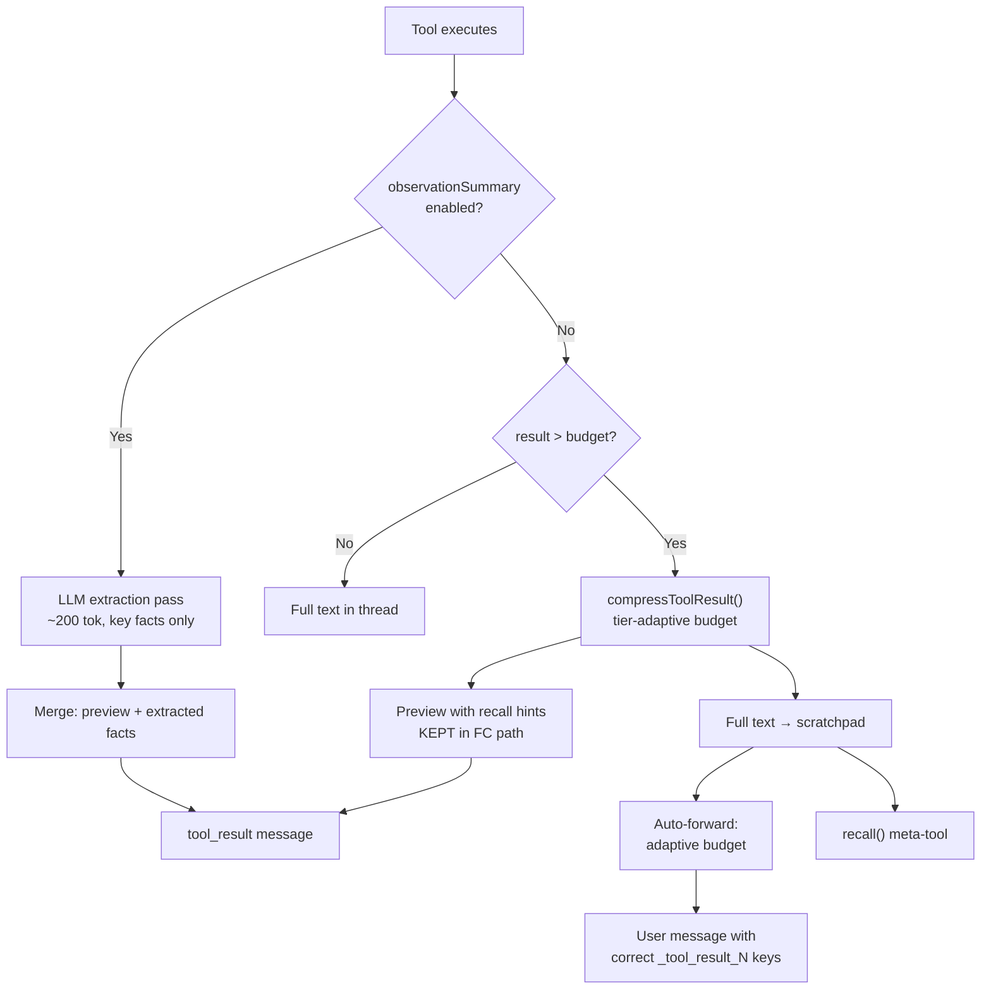

# Observation Quality Pipeline

## Problem

Tool results are compressed to ~800 chars with 3-5 line previews. Three bugs prevent the model from accessing full stored data, and the static compression budget doesn't adapt to model capability. Small/local models especially struggle to synthesize answers from compressed previews.

## Architecture



## Phase 1: Fix Bugs (3 changes)

### Bug 1: FC path strips recall hints from compressed previews

**File:** [`packages/reasoning/src/strategies/kernel/utils/tool-execution.ts`](packages/reasoning/src/strategies/kernel/utils/tool-execution.ts) ~537-559

The FC cleanup regex removes `[STORED: ...]` headers and all `recall(...)` hints. The model sees `[web-search result — compressed preview]` but has no idea the full text is retrievable. **Fix:** Keep a single-line recall hint at the end of the preview. Replace the aggressive strip with a condensed hint like:

```
[web-search result — compressed preview]
1. XRP price is $1.34 ...
2. ...
— full text stored as _tool_result_2. Use recall("_tool_result_2") to retrieve.
```

### Bug 2: Message window uses wrong recall key

**File:** [`packages/reasoning/src/context/message-window.ts`](packages/reasoning/src/context/message-window.ts) ~168-174

When micro-compacting old tool results, the placeholder says `use recall("${toolCallId}")` but scratchpad keys are `_tool_result_N`. The toolCallId (provider-assigned) doesn't match the scratchpad key. **Fix:** Thread the `storedKey` from step metadata through to the message window. If unavailable, fall back to the existing `toolCallId` behavior.

### Bug 3: Auto-forward budget is static 3000 chars

**File:** [`packages/reasoning/src/strategies/kernel/phases/think.ts`](packages/reasoning/src/strategies/kernel/phases/think.ts) ~189

The `AUTO_FORWARD_BUDGET` is hardcoded at 3000 chars regardless of how many stored results exist. For 4 parallel results, each gets ~750 chars. **Fix:** Make the budget adaptive: `BASE_BUDGET + (PER_RESULT_BUDGET * storedKeyCount)`. Suggested values: base 1500, per-result 1000, so 4 results get 5500 chars total. Cap at a max (e.g. 8000) to avoid context bloat.

## Phase 2: Tier-Adaptive Compression Budgets

### Adaptive budget in tool-execution.ts

**Files:**

- [`packages/reasoning/src/strategies/kernel/utils/tool-execution.ts`](packages/reasoning/src/strategies/kernel/utils/tool-execution.ts) ~441 (text path) and ~537 (FC path)
- [`packages/reasoning/src/context/context-profile.ts`](packages/reasoning/src/context/context-profile.ts) — `CONTEXT_PROFILES` per tier

Current default: 800 chars for all tiers. Change to tier-adaptive:

| Tier     | Budget | Preview Items | Rationale                                           |
| -------- | ------ | ------------- | --------------------------------------------------- |
| local    | 2000   | 8             | Local models need more raw data to synthesize       |
| mid      | 1200   | 5             | Balance between context cost and extraction ability |
| large    | 800    | 5             | Current default, good for capable models            |
| frontier | 600    | 3             | Frontier models extract well from minimal context   |

These can live as `toolResultMaxChars` and `toolResultPreviewItems` on `ContextProfile`, falling back to the existing defaults when not set. The execution paths in `tool-execution.ts` already read `profile?.toolResultMaxChars`.

## Phase 3: Optional LLM Extraction Pass

### New: `extractObservationFacts` in tool-execution pipeline

**New function in:** [`packages/reasoning/src/strategies/kernel/utils/tool-execution.ts`](packages/reasoning/src/strategies/kernel/utils/tool-execution.ts)

When enabled via `KernelInput.observationSummary` (wired from `.withReasoning({ observationSummary: true })`), after tool execution and before compression:

1. Call `LLMService.complete()` with a focused extraction prompt:
   ```
   Extract the key data points from this tool result. Return ONLY a concise
   bullet list of facts (numbers, names, dates, URLs). No commentary.
   Tool: {toolName}
   Query: {arguments}
   Result:
   {raw result, truncated to ~2000 chars}
   ```
2. Use very low `maxTokens` (~200) and `temperature: 0` for deterministic extraction.
3. Prepend the extracted facts to the compressed preview, giving the model both the distilled data AND the recall hint for full access.

**Result format in thread:**

```
[web-search result — key facts extracted]
- XRP: $1.34 (CoinGecko, CoinMarketCap, Binance)
- 24h volume: $1.9B, up 0.91%
[5 more results stored — use recall("_tool_result_1") for full text]
```

**Configuration wiring:**

- Builder: `.withReasoning({ observationSummary: true | false | "auto" })`
- `"auto"` mode: only extract for large results (over compression budget) on `local`/`mid` tiers
- Passed through `ExecutionEngine` → `KernelInput` → `tool-execution.ts`

**LLM call routing:**

- Use the same LLM provider/model as the main agent (simplest)
- Future: allow a separate `summaryModel` config for using a cheaper model

**Latency mitigation:**

- Only runs when result exceeds compression budget (small results pass through unchanged)
- Parallel tool calls: extract all observations concurrently with `Effect.all({ concurrency: "unbounded" })`
- Skip for meta-tools (brief, pulse, recall, find) which are already compact

## Testing

- Unit tests for each bug fix (recall hint preservation, correct scratchpad key, adaptive budget)
- Unit test for tier-adaptive budget selection
- Unit test for LLM extraction (mock LLMService, verify prompt shape and result integration)
- End-to-end `scratch.ts` validation in both sequential and parallel modes

## Files to Modify

| File                                                               | Changes                                                                    |
| ------------------------------------------------------------------ | -------------------------------------------------------------------------- |
| `packages/reasoning/src/strategies/kernel/utils/tool-execution.ts` | Bug 1 (keep recall hints), Phase 2 (tier budget), Phase 3 (LLM extraction) |
| `packages/reasoning/src/context/message-window.ts`                 | Bug 2 (correct recall key from storedKey)                                  |
| `packages/reasoning/src/strategies/kernel/phases/think.ts`         | Bug 3 (adaptive auto-forward budget)                                       |
| `packages/reasoning/src/context/context-profile.ts`                | Phase 2 (per-tier `toolResultMaxChars` / `toolResultPreviewItems`)         |
| `packages/reasoning/src/strategies/kernel/kernel-state.ts`         | Phase 3 (add `observationSummary` to `KernelInput`)                        |
| `packages/runtime/src/execution-engine.ts`                         | Phase 3 (wire `observationSummary` from builder config)                    |
| `packages/reasoning/src/strategies/kernel/phases/act.ts`           | Bug 2 (pass storedKey through to messages for window)                      |
