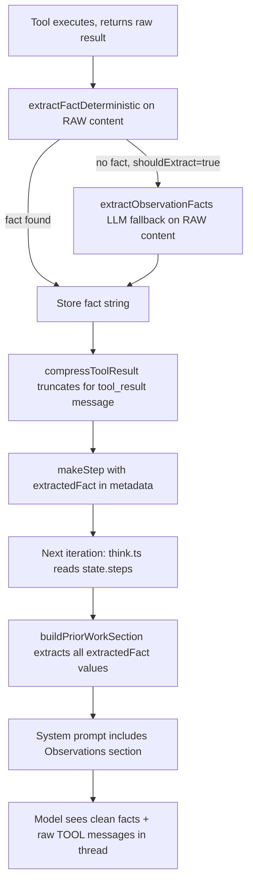

# Wire Observation Facts Pipeline

## Problem

The agent sees raw, truncated web scraping content in `[TOOL]` messages but has no clean observation summary in the system prompt. Three links are broken:

1. **Extraction runs on compressed content** -- `extractObservationFacts()` receives already-truncated output (800 chars), not the raw result. The XLM price was literally cut at "The current price of St".
2. **`extractedFact` is never stored** -- even when extraction succeeds, the result replaces `obsContent` but is never set as `step.metadata.extractedFact`.
3. **`buildPriorWorkSection()` is never called** -- the `ContextManager` we built has the right code but `think.ts` never calls it. The system prompt has no "Prior work" / "Observations" section.

## Fix: 3 Phases (TDD)

### Phase 1: Deterministic fact extraction (no LLM call)

Add a new pure function `extractFactDeterministic()` in [tool-execution.ts](packages/reasoning/src/strategies/kernel/utils/tool-execution.ts) that runs on the **raw** tool output (before compression) and uses regex patterns to extract common data:

- **Prices**: `/\$[\d,]+\.?\d*/g` -- captures dollar amounts
- **Tool name + query context**: uses the tool args (e.g., `query: "XRP price USD"`) to label the fact
- **URL source**: extracts the first URL from the result for attribution
- **Fallback**: if no structured data found, returns first sentence that contains a number

Output format: `"web-search('XRP price USD'): XRP costs $1.327 (source: revolut.com)"`

This runs instantly with zero LLM calls. The existing `extractObservationFacts()` LLM path becomes the fallback when deterministic extraction finds nothing meaningful.

**Key change in execution order** (in [act.ts](packages/reasoning/src/strategies/kernel/phases/act.ts)):

```
BEFORE: raw → compress → extract(compressed) → makeStep(no extractedFact)
AFTER:  raw → extractFactDeterministic(raw) → compress → makeStep(extractedFact: fact)
         └─ if deterministic fails and shouldExtract → extractObservationFacts(raw)
```

The critical change: extraction operates on the raw content, BEFORE compression destroys it.

### Phase 2: Store `extractedFact` on step metadata

In [act.ts](packages/reasoning/src/strategies/kernel/phases/act.ts), update both the parallel batch path (line ~526) and the sequential path (line ~670+) `makeStep()` calls to include `extractedFact` in metadata:

```typescript
const obsStep = makeStep("observation", obsContent, {
  toolCallId: result.callId,
  storedKey: result.execResult.storedKey,
  extractedFact: fact,  // <-- NEW: the distilled one-liner
  observationResult: makeObservationResult(...),
});
```

Where `fact` comes from the deterministic extractor (Phase 1), falling back to the LLM extractor if configured.

### Phase 3: Wire `buildPriorWorkSection` into the system prompt

Two options here -- recommend **Option A** (minimal wiring):

**Option A** -- Call `buildPriorWorkSection(state)` directly from `think.ts`'s existing system prompt assembly. This is a ~5 line addition to the existing prompt construction in `think.ts`, right before the Guidance section. No need to fully replace the system prompt path with `ContextManager.build()` yet.

Specifically in [think.ts](packages/reasoning/src/strategies/kernel/phases/think.ts), after the base system prompt is built and before the Guidance section is appended:

```typescript
import { buildPriorWorkSection, buildGuidanceSection, ... } from "../../context/context-manager.js";

// After baseSystemPromptText is assembled:
const priorWork = buildPriorWorkSection(state);
const guidanceSection = buildGuidanceSection(guidance);
const systemPromptText = [baseSystemPromptText, priorWork, guidanceSection]
  .filter(Boolean)
  .join("\n\n");
```

This means the system prompt on iteration 2+ will include:

```
Observations:
- web-search('XRP price USD'): XRP costs $1.327 (source: revolut.com)
- web-search('XLM price USD'): no specific price found in results
- web-search('ETH price USD'): no specific price found in results
- web-search('Bitcoin price USD'): BTC costs $67,661.63 (source: independentreserve.com)
```

The model now has a clean, reliable summary in the system prompt without parsing raw web content or using recall.

## Files Changed

| File                                                                       | Change                                                                                |
| -------------------------------------------------------------------------- | ------------------------------------------------------------------------------------- |
| `packages/reasoning/src/strategies/kernel/utils/tool-execution.ts`         | Add `extractFactDeterministic()`, export it                                           |
| `packages/reasoning/src/strategies/kernel/phases/act.ts`                   | Fix execution order (extract raw -> compress), store `extractedFact` on step metadata |
| `packages/reasoning/src/strategies/kernel/phases/think.ts`                 | Import + call `buildPriorWorkSection(state)`, append to system prompt                 |
| `packages/reasoning/src/context/context-manager.ts`                        | Rename "Prior work" to "Observations" in `buildPriorWorkSection` for clarity          |
| `packages/reasoning/tests/strategies/kernel/utils/tool-execution.test.ts`  | Tests for `extractFactDeterministic()`                                                |
| `packages/reasoning/tests/context/context-manager.test.ts`                 | Tests for observation rendering                                                       |
| `packages/reasoning/tests/strategies/kernel/phases/act-extraction.test.ts` | Integration test: fact stored on step metadata                                        |

## Data Flow After Fix



## What This Does NOT Change

- The raw `[TOOL]` messages in the conversation thread stay as-is (compressed previews). They serve as the native FC conversation thread.
- The `recall()` tool remains available for retrieving full stored results when needed.
- The LLM extraction path remains as a configurable fallback (for complex non-structured results).
- `ContextManager.build()` full wiring is deferred -- we only pull in `buildPriorWorkSection` for now.

---

## Context architecture (research-aligned, Ollama-first)

**Principle: use both layers; they solve different problems.**

| Layer | Role | What belongs here |
| ----- | ---- | ----------------- |
| **System prompt (dynamic per turn)** | Instructions + harness state | Task, rules, tool list, **Guidance** (required tools, loop, evidence checks), **Observations** (distilled facts from prior tool runs — not a substitute for tool messages). |
| **Native FC thread** | Turn-taking the model was trained on | `assistant` + `tool_use` / `tool` (tool_result) pairs. **Compact, faithful** observation text in each tool message — this is the canonical place the model learns to "read" tool output. |

**Why not put everything only in the system message?**

- Stuffed system prompts grow fast, repeat every request, and **blur** the boundary between "instructions" and "evidence". Models can over-trust a summary and under-read tool blocks (or the reverse).
- **Tool messages** preserve the FC contract: the model must ground answers in what appeared after its own tool calls.

**Why not rely only on tool messages (no Observations section)?**

- For **local** models, raw web-search snippets are noisy and often **truncated** before the answer token appears. A **one-line deterministic fact** in `Observations:` (from raw pre-compression) repairs recall without replacing the tool message.
- For **frontier** models, Observations can stay minimal or off; tier-gating in `ContextProfile` / calibration can shrink that section.

**Conclusion:** Best default for Ollama: **keep native tool messages** (compact but correct-order, tool-call IDs preserved) **and** add a **small, updating Observations** block in the system prompt for distilled facts. This matches common FC API design (OpenAI/Anthropic/Ollama): system = policy + summary; tools = evidence.

---

## Ollama probe: [ollama-native-fc-context-probe.ts](.agents/skills/harness-improvement-loop/scripts/ollama-native-fc-context-probe.ts)

**What it validates today**

- Parity between **Ollama JS SDK** `chat` (tools, non-stream) and **`LLMService.complete`** (framework): tool call **counts**, **names**, **argument key shapes** per scenario.
- Scenarios mix **synthetic thread text inside the system prompt** (legacy harness shape) — useful for FC stability under noisy context, not a pure "native tool transcript" test.

**Gap vs your question ("tool messages most effective?")**

- `buildSdkMessages` maps any `role: "tool"` message to **`role: "user"`** with a `[TOOL:...]` prefix (lines 307–311). So the **SDK path is not exercising Ollama's native tool-result message type** if/when the API accepts a dedicated tool role in the message array.
- The **framework path** already uses structured `LLMMessage` with `role: "tool"` where supported; the probe should add a **dedicated scenario**: multi-turn with **real** assistant tool_calls + tool results in `messages`, **no** fake thread in system — then compare answer grounding (e.g. "does output contain only numbers present in tool bodies?").

**Recommended probe extensions (future todos)**

1. **Scenario `native-tool-transcript`**: system = instructions only; messages = user task → assistant (tool_calls) → tool (results) → user optional; measure **hallucination rate** and token use vs system-stuffed replay.
2. **Optional**: If Ollama's HTTP API documents a distinct tool message role for chat, align `buildSdkMessages` with that shape so SDK vs framework compares apples-to-apples.

---

## Model adapter + calibration: wiring status

**Provider adapters (`selectAdapter`)**

- [adapter.ts](packages/llm-provider/src/adapter.ts) **`selectAdapter(_capabilities, tier, _modelId)`** — **`_modelId` is intentionally unused** (comment: "Phase 6"). Selection is **tier-only** (`local` → `localModelAdapter`, `mid` → `midModelAdapter`, else `defaultAdapter`).
- So any "per-model adapter probe" or JSON profile from calibration is **not** applied at runtime yet.

**Calibration elsewhere in the monorepo**

- [reactive-intelligence](packages/reactive-intelligence) has **CalibrationStore**, conformal scoring, persistence tests — oriented around **entropy distributions / drift**, not yet feeding **reasoning context** or `ProviderAdapter` merges.
- **No bridge** today: `ModelCalibration` JSON → `selectAdapter` → `ContextProfile` knobs (budget, `toolResultMaxChars`, Observations on/off, extraction mode) is **unimplemented**.

**How calibration should unlock local models (target architecture)**

1. **Offline probe suite** (6–10 fixed prompts + tool stubs): measure tool-call format (native vs text JSON), parallel call rate, instruction-following, numeric grounding, hallucination under truncation.
2. **Emit `ModelCalibration`**: e.g. `prefersCompactToolText`, `maxObservationLines`, `needsObservationsSection`, `parallelToolCallsReliable`, `recommendedTier`, adapter hook overrides.
3. **Runtime merge order** (when implemented): `defaultAdapter` ← **tier adapter** ← **calibration overlay** (per `modelId`) ← optional user overrides.
4. **ContextManager**: use calibration to toggle **Observations** depth, **compression budget**, and **deterministic vs LLM** extraction without hard-coding per model in source.

---

## Relationship to this plan's implementation

- **Phases 1–3** (deterministic extract → `extractedFact` → `buildPriorWorkSection` in `think.ts`) implement the **Observations** half of the dual-layer architecture above.
- **Probe extensions** and **calibration → adapter** are **sequential follow-ups**: they validate and tune the same pipeline per model without changing the core invariant — **tool messages stay canonical; system prompt adds cheap recall for small models.**

### Additional todos (calibration / probe track)

- `probe-native-tool-transcript` — Add `native-tool-transcript` scenario to ollama-native-fc-context-probe; optional SDK tool-role alignment.
- `phase6-calibration-bridge` — Define `ModelCalibration` schema; load in `selectAdapter(modelId)`; map fields to `ContextProfile` + adapter merge (separate PR from observation facts).
