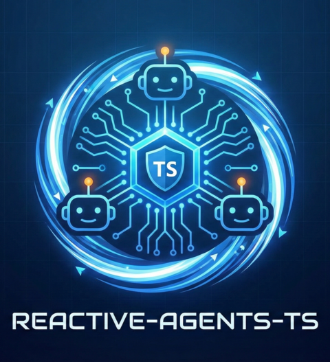

<div align="center">



# Reactive Agents

**The composable AI agent framework built on Effect-TS.**

Type-safe from prompt to production. 15 packages. 13 composable layers. 5 reasoning strategies. 10-phase execution engine.

[](https://github.com/tylerjrbuell/reactive-agents-ts/actions/workflows/ci.yml)
[](https://www.npmjs.com/org/reactive-agents)
[](LICENSE)
[](https://www.typescriptlang.org/)
[](https://effect.website)
[](https://bun.sh)
[](https://github.com/tylerjrbuell/reactive-agents-ts/pulls)

[Documentation](https://tylerjrbuell.github.io/reactive-agents-ts/) · [Quick Start](#quick-start) · [Architecture](#architecture) · [Packages](#packages)

</div>

---

## Why Reactive Agents?

Most AI agent frameworks are dynamically typed, monolithic, and opaque. **Reactive Agents** takes a fundamentally different approach:

| Problem | How We Solve It |
|---------|----------------|
| **No type safety** | Effect-TS schemas validate every service boundary at compile time |
| **Monolithic** | 13 independent layers — enable only what you need |
| **Opaque decisions** | 10-phase execution engine with before/after/error hooks on every phase |
| **Unsafe by default** | Guardrails block injection/PII/toxicity before the LLM sees input |
| **No cost control** | Complexity router picks the cheapest capable model; budget enforcement at 4 levels |
| **Single reasoning mode** | 5 strategies (ReAct, Reflexion, Plan-Execute, Tree-of-Thought, Adaptive) |

## Quick Start

```bash
bun add reactive-agents effect
```

```typescript
import { ReactiveAgents } from "reactive-agents";

const agent = await ReactiveAgents.create()
  .withName("assistant")
  .withProvider("anthropic")
  .withModel("claude-sonnet-4-20250514")
  .build();

const result = await agent.run("Explain quantum entanglement");
console.log(result.output);
console.log(result.metadata); // { duration, cost, tokensUsed, stepsCount }
```

### Add Capabilities

Every capability is opt-in. Chain what you need:

```typescript
const agent = await ReactiveAgents.create()
  .withName("research-agent")
  .withProvider("anthropic")
  .withReasoning()            // ReAct reasoning loop
  .withTools([searchTool])    // Tools called during reasoning
  .withMemory("1")            // Persistent memory (FTS5 search)
  .withGuardrails()           // Block injection, PII, toxicity
  .withVerification()         // Fact-check outputs
  .withCostTracking()         // Budget enforcement + model routing
  .withObservability()        // Distributed tracing + metrics
  .withIdentity()             // RBAC + agent certificates
  .withInteraction()          // 5 autonomy modes
  .withOrchestration()        // Multi-agent workflows
  .build();
```

### Define Tools

```typescript
import { defineTool } from "@reactive-agents/tools";
import { Effect, Schema } from "effect";

const searchTool = defineTool({
  name: "web_search",
  description: "Search the web for current information",
  input: Schema.Struct({ query: Schema.String }),
  handler: ({ query }) => Effect.succeed(`Results for: ${query}`),
});
```

When reasoning is enabled, the agent calls tools during the Think → Act → Observe loop and uses real results to inform its reasoning.

## Architecture

```
ReactiveAgentBuilder
  → createRuntime()
    → Core Services     EventBus, AgentService, TaskService
    → LLM Provider      Anthropic, OpenAI, Gemini, Ollama
    → Memory            Working, Semantic, Episodic, Procedural
    → Reasoning         ReAct, Reflexion, Plan-Execute, ToT, Adaptive
    → Tools             Registry, Sandbox, MCP Client
    → Guardrails        Injection, PII, Toxicity, Contracts
    → Verification      Semantic Entropy, Fact Decomposition, NLI
    → Cost              Complexity Router, Budget Enforcer, Cache
    → Identity          Certificates, RBAC, Delegation, Audit
    → Observability     Tracing, Metrics, Structured Logging
    → Interaction       5 Modes, Checkpoints, Preference Learning
    → Orchestration     Sequential, Parallel, Pipeline, Map-Reduce
    → Prompts           Template Engine, Version Control
    → ExecutionEngine   10-phase lifecycle with hooks
```

Every layer is an Effect `Layer` — composable, independently testable, and tree-shakeable.

## 10-Phase Execution Engine

Every task flows through a deterministic lifecycle. Each phase calls its corresponding service when enabled:

```
Bootstrap ─→ Guardrail ─→ Cost Route ─→ Strategy Select
                                              │
                                    ┌─────────▼─────────┐
                                    │ Think → Act → Observe │ ← loop
                                    └─────────┬─────────┘
                                              │
Verify ─→ Memory Flush ─→ Cost Track ─→ Audit ─→ Complete
```

| Phase | Service Called | What It Does |
|-------|--------------|-------------|
| Bootstrap | MemoryService | Load context from semantic/episodic memory |
| Guardrail | GuardrailService | Block unsafe input before LLM sees it |
| Cost Route | CostService | Select optimal model tier by complexity |
| Strategy Select | ReasoningService | Pick reasoning strategy (or direct LLM) |
| Think/Act/Observe | LLMService + ToolService | Reasoning loop with real tool execution |
| Verify | VerificationService | Fact-check output (entropy, decomposition, NLI) |
| Memory Flush | MemoryService | Persist session + episodic memories |
| Cost Track | CostService | Record spend against budget |
| Audit | ObservabilityService | Log audit trail (tokens, cost, strategy, duration) |
| Complete | — | Build final result with metadata |

Every phase supports `before`, `after`, and `on-error` lifecycle hooks. When observability is enabled, every phase emits trace spans and metrics.

## 5 Reasoning Strategies

| Strategy | How It Works | Best For |
|----------|-------------|----------|
| **ReAct** | Think → Act → Observe loop | Tool use, step-by-step tasks |
| **Reflexion** | Generate → Critique → Improve | Quality-critical output |
| **Plan-Execute** | Plan steps → Execute → Reflect → Refine | Structured multi-step work |
| **Tree-of-Thought** | Branch → Score → Prune → Synthesize | Creative, open-ended problems |
| **Adaptive** | Analyze task → Auto-select best strategy | Mixed workloads |

```typescript
// Auto-select the best strategy per task
const agent = await ReactiveAgents.create()
  .withProvider("anthropic")
  .withReasoning({ defaultStrategy: "adaptive" })
  .build();
```

## Multi-Provider Support

| Provider | Models | Tool Calling | Streaming |
|----------|--------|:---:|:---:|
| **Anthropic** | Claude Haiku, Sonnet, Opus | ✓ | ✓ |
| **OpenAI** | GPT-4o, GPT-4o-mini | ✓ | ✓ |
| **Google Gemini** | Gemini Flash, Pro | ✓ | ✓ |
| **Ollama** | Any local model | — | ✓ |
| **Test** | Mock (deterministic) | — | — |

Switch providers with one line — agent code stays the same.

## Packages

| Package | Description |
|---------|-------------|
| [`@reactive-agents/core`](packages/core) | EventBus, AgentService, TaskService, types |
| [`@reactive-agents/runtime`](packages/runtime) | ExecutionEngine, ReactiveAgentBuilder, `createRuntime()` |
| [`@reactive-agents/llm-provider`](packages/llm-provider) | LLM adapters (Anthropic, OpenAI, Gemini, Ollama) |
| [`@reactive-agents/memory`](packages/memory) | Working, Semantic, Episodic, Procedural memory (bun:sqlite) |
| [`@reactive-agents/reasoning`](packages/reasoning) | 5 strategies: ReAct, Reflexion, Plan-Execute, ToT, Adaptive |
| [`@reactive-agents/tools`](packages/tools) | Tool registry, sandboxed execution, MCP client |
| [`@reactive-agents/guardrails`](packages/guardrails) | Injection, PII, toxicity detection |
| [`@reactive-agents/verification`](packages/verification) | Semantic entropy, fact decomposition, NLI |
| [`@reactive-agents/cost`](packages/cost) | Complexity routing, budget enforcement, semantic caching |
| [`@reactive-agents/identity`](packages/identity) | Agent certificates, RBAC, delegation |
| [`@reactive-agents/observability`](packages/observability) | Distributed tracing, metrics, structured logging |
| [`@reactive-agents/interaction`](packages/interaction) | 5 autonomy modes, checkpoints, preference learning |
| [`@reactive-agents/orchestration`](packages/orchestration) | Multi-agent workflows (sequential, parallel, map-reduce, pipeline) |
| [`@reactive-agents/prompts`](packages/prompts) | Version-controlled template engine |
| [`@reactive-agents/eval`](packages/eval) | Evaluation framework (LLM-as-judge scoring) |

## CLI (`rax`)

```bash
rax init my-project --template full           # Scaffold a project
rax create agent researcher --recipe researcher  # Generate an agent
rax run "Explain quantum computing" --provider anthropic  # Run an agent
```

## Testing

Built-in test provider for deterministic, offline tests:

```typescript
const agent = await ReactiveAgents.create()
  .withProvider("test")
  .withTestResponses({
    "capital of France": "Paris is the capital of France.",
  })
  .build();

const result = await agent.run("What is the capital of France?");
// result.output → "Paris is the capital of France."
```

## Development

```bash
bun install              # Install dependencies
bun test                 # Run all tests (340+ tests, 60+ files)
bun run build            # Build all packages (ESM + DTS)
```

## Environment Variables

```bash
ANTHROPIC_API_KEY=sk-ant-...          # Anthropic Claude
OPENAI_API_KEY=sk-...                 # OpenAI GPT-4o
GOOGLE_API_KEY=...                    # Google Gemini
EMBEDDING_PROVIDER=openai             # For Tier 2 vector memory
EMBEDDING_MODEL=text-embedding-3-small
LLM_DEFAULT_MODEL=claude-sonnet-4-20250514
```

## Documentation

Full documentation at **[tylerjrbuell.github.io/reactive-agents-ts](https://tylerjrbuell.github.io/reactive-agents-ts/)**

- [Getting Started](https://tylerjrbuell.github.io/reactive-agents-ts/guides/quickstart/) — Build an agent in 5 minutes
- [Reasoning Strategies](https://tylerjrbuell.github.io/reactive-agents-ts/guides/reasoning/) — All 5 strategies explained
- [Architecture](https://tylerjrbuell.github.io/reactive-agents-ts/concepts/architecture/) — Layer system deep dive
- [Cookbook](https://tylerjrbuell.github.io/reactive-agents-ts/cookbook/testing-agents/) — Testing, multi-agent patterns, production deployment

## License

MIT
