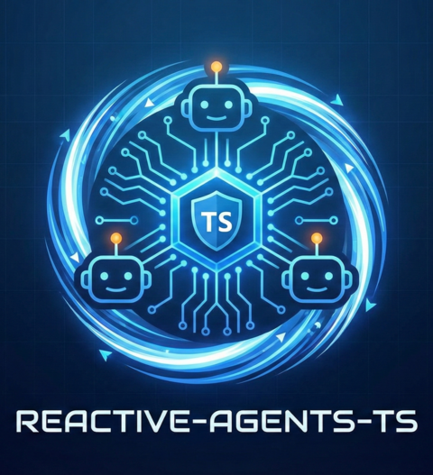

<div align="center">



# Reactive Agents — TypeScript AI Agent Framework

**A composable, type-safe AI agent framework for TypeScript, built on Effect-TS.**

Type-safe from prompt to production. 20 packages. 13 composable layers. 5 reasoning strategies. 10-phase execution engine. 8 built-in tools. Model-adaptive context engineering. Persistent autonomous gateway with adaptive heartbeats, crons, and webhooks. Required tools guard with adaptive LLM inference. Circuit breaker and embedding cache for LLM resilience. Structured agent steering via personas. Real Ed25519 cryptography, kill switch, behavioral contracts, cross-task self-improvement, and full real-time EventBus observability.

[](https://github.com/tylerjrbuell/reactive-agents-ts/actions/workflows/ci.yml)
[](https://www.npmjs.com/org/reactive-agents)
[](https://www.npmjs.com/package/reactive-agents)
[](LICENSE)
[](https://www.typescriptlang.org/)
[](https://effect.website)
[](https://bun.sh)
[](https://github.com/tylerjrbuell/reactive-agents-ts/pulls)

[Documentation](https://tylerjrbuell.github.io/reactive-agents-ts/) · [Discord](https://discord.gg/498xEG5A) · [Quick Start](#quick-start) · [Features](#features) · [Use Cases](#use-cases) · [Architecture](#architecture) · [Packages](#packages)

</div>

---

## Why Reactive Agents?

Most AI agent frameworks are dynamically typed, monolithic, and opaque. **Reactive Agents** takes a fundamentally different approach:

| Problem                        | How We Solve It                                                                     |
| ------------------------------ | ----------------------------------------------------------------------------------- |
| **No type safety**             | Effect-TS schemas validate every service boundary at compile time                   |
| **Monolithic**                 | 13 independent layers — enable only what you need                                   |
| **Opaque decisions**           | 10-phase execution engine with before/after/error hooks on every phase              |
| **Unsafe by default**          | Guardrails block injection/PII/toxicity before the LLM sees input                   |
| **No cost control**            | Complexity router picks the cheapest capable model; budget enforcement at 4 levels  |
| **Single reasoning mode**      | 5 strategies (ReAct, Reflexion, Plan-Execute, Tree-of-Thought, Adaptive)            |
| **Context bloat in long runs** | Model-adaptive context engineering — compaction, truncation, and tier-aware prompts |

## Features

- TypeScript-first AI agent framework with Effect-TS type safety
- Multi-agent orchestration with A2A protocol and agent-as-tool composition
- MCP client support for external tools and integrations
- Built-in reasoning strategies: ReAct, Reflexion, Plan-Execute, Tree-of-Thought, Adaptive
- Required tools guard — ensure agents call critical tools before answering (static list or adaptive LLM inference)
- Production guardrails: injection, PII, toxicity, kill switch, behavioral contracts
- LLM resilience: circuit breaker, embedding cache, budget persistence across restarts
- Real-time observability: EventBus events, tracing, OTLP export, live execution metrics dashboard
- Cost and budget controls with model routing, semantic caching, and 27 complexity signals
- Telemetry system with privacy-preserving aggregation and local-first collection
- Tool result caching and Docker sandbox execution for secure code evaluation
- Local-first + cloud model support (Ollama, Anthropic, OpenAI, Gemini, LiteLLM)

## Use Cases

- Autonomous engineering agents with tool execution and code generation
- Research and reporting workflows with verifiable reasoning steps
- Scheduled background agents using heartbeats, cron jobs, and webhooks
- Secure enterprise copilots with RBAC, audit trails, and policy controls
- Hybrid local/cloud AI deployments with adaptive context profiles

## Comparison

Reactive Agents is designed for teams that need production-grade TypeScript AI agents with explicit architecture, strong typing, and observability.

| Framework Focus     | Reactive Agents                                           |
| ------------------- | --------------------------------------------------------- |
| Type safety         | Effect-TS-first service boundaries with schema validation |
| Architecture        | Composable layers instead of monolithic runtime           |
| Reasoning           | 5 built-in strategies + adaptive strategy selection       |
| Tooling             | Native MCP support, sandboxed tools, agent-as-tool        |
| Production controls | Guardrails, cost budgets, audit trails, kill switch       |
| Visibility          | EventBus tracing, structured logs, metrics dashboard      |

## Quick Start

Install and run your first TypeScript AI agent in under 2 minutes.

```bash
bun add reactive-agents
```

> **Note:** `effect` is included as a dependency of `reactive-agents` and installed automatically. If you import from `effect` directly in your own code (e.g. `import { Effect } from "effect"`), add it to your project explicitly: `bun add effect`.

```typescript
import { ReactiveAgents } from "reactive-agents";

const agent = await ReactiveAgents.create()
  .withName("assistant")
  .withProvider("anthropic")
  .withModel("claude-sonnet-4-20250514")
  .build();

const result = await agent.run("Explain quantum entanglement");
console.log(result.output);
console.log(result.metadata); // { duration, cost, tokensUsed, stepsCount }
// ✅ Observability enabled: Professional metrics dashboard displayed automatically
```

## FAQ

### Which models and providers are supported?

Reactive Agents supports Anthropic, OpenAI, Google Gemini, Ollama (local), and LiteLLM (proxy for many providers).

### Is this framework production-ready?

Yes — it includes guardrails, budget controls, auditability, observability, and composable service layers for testable deployments.

### Can I run fully local agents?

Yes — use Ollama with local models plus context profiles tuned for local inference.

### Add Capabilities

Every capability is opt-in. Chain what you need:

```typescript
const agent = await ReactiveAgents.create()
  .withName("research-agent")
  .withProvider("anthropic")
  .withReasoning() // ReAct reasoning loop
  .withTools() // Built-in tools + MCP support
  .withMemory("1") // Persistent memory (FTS5 search)
  .withGuardrails() // Block injection, PII, toxicity
  .withKillSwitch() // Per-agent + global emergency halt
  .withBehavioralContracts({
    // Enforce tool whitelist + iteration cap
    deniedTools: ["file-write"],
    maxIterations: 10,
  })
  .withVerification() // Fact-check outputs
  .withCostTracking() // Budget enforcement + model routing
  .withObservability({ verbosity: "verbose", live: true }) // Live log streaming + tracing
  .withContextProfile({ tier: "local" }) // Adaptive context for model tier
  .withIdentity() // RBAC + agent certificates (Ed25519)
  .withInteraction() // 5 autonomy modes
  .withOrchestration() // Multi-agent workflows
  .withSelfImprovement() // Cross-task strategy outcome learning
  .withRequiredTools({
    // Ensure agent calls critical tools before answering
    tools: ["web-search"],  // or: adaptive: true — LLM infers required tools
    maxRetries: 2,
  })
  .withGateway({
    // Persistent autonomous harness
    heartbeat: { intervalMs: 1_800_000, policy: "adaptive" },
    crons: [{ schedule: "0 9 * * MON", instruction: "Weekly review" }],
    policies: { dailyTokenBudget: 50_000 },
  })
  .build();
```

### Register Custom Tools

Tools are registered at build time or via `ToolService.register()`. Built-in tools (web search, file I/O, HTTP, code execution, scratchpad-write, scratchpad-read (persistent notes), spawn-agent (dynamic sub-agent delegation)) are available automatically when the relevant builder methods are enabled.

```typescript
import { ReactiveAgents } from "reactive-agents";
import { Effect } from "effect";

const agent = await ReactiveAgents.create()
  .withProvider("anthropic")
  .withReasoning()
  .withTools({
    tools: [
      {
        definition: {
          name: "web_search",
          description: "Search the web for current information",
          parameters: [
            {
              name: "query",
              type: "string",
              description: "Search query",
              required: true,
            },
          ],
          riskLevel: "low",
          timeoutMs: 10_000,
          requiresApproval: false,
          source: "function",
        },
        handler: (args) => Effect.succeed(`Results for: ${args.query}`),
      },
    ],
  })
  .build();
```

When reasoning is enabled, the agent calls tools during the Think → Act → Observe loop and uses real results to inform its reasoning.

### Dynamic Sub-Agent Spawning

Use `.withDynamicSubAgents()` to let the model spawn ad-hoc sub-agents at runtime without pre-configuring named agent tools. This registers the built-in `spawn-agent` tool, which the model can invoke freely:

```typescript
const agent = await ReactiveAgents.create()
  .withProvider("anthropic")
  .withModel("claude-sonnet-4-6")
  .withTools()
  .withDynamicSubAgents({ maxIterations: 5 })
  .build();
```

Sub-agents receive a clean context window, inherit the parent's provider and model by default, and are depth-limited to `MAX_RECURSION_DEPTH = 3`.

| Approach                         | When to use                                            |
| -------------------------------- | ------------------------------------------------------ |
| `.withAgentTool("name", config)` | Named, purpose-built sub-agent with a specific role    |
| `.withDynamicSubAgents()`        | Ad-hoc delegation at model's discretion, unknown tasks |

### Model-Adaptive Context

Optimize prompt construction and context compaction for your model tier:

```typescript
// Optimize context for your model tier
const agent = await ReactiveAgents.create()
  .withProvider("ollama")
  .withModel("qwen3:4b")
  .withReasoning()
  .withTools()
  .withContextProfile({ tier: "local" }) // Lean prompts, aggressive compaction
  .build();
```

| Tier      | Models                     | Context Strategy                                                       |
| --------- | -------------------------- | ---------------------------------------------------------------------- |
| `"local"` | Ollama small models (≤14b) | Lean prompts, aggressive compaction after 6 steps, 800-char truncation |
| `"cloud"` | Anthropic, OpenAI, Gemini  | Full context, standard compaction                                      |

## Architecture

```
ReactiveAgentBuilder
  → createRuntime()
    → Core Services     EventBus, AgentService, TaskService
    → LLM Provider      Anthropic, OpenAI, Gemini, Ollama, LiteLLM
    → Memory            Working, Semantic, Episodic, Procedural
    → Reasoning         ReAct, Reflexion, Plan-Execute, ToT, Adaptive
    → Tools             Registry, Sandbox, MCP Client
    → Guardrails        Injection, PII, Toxicity, Kill Switch, Behavioral Contracts
    → Verification      Semantic Entropy, Fact Decomposition, NLI
    → Cost              Complexity Router, Budget Enforcer, Cache
    → Identity          Certificates, RBAC, Delegation, Audit
    → Observability     Tracing, Metrics, Structured Logging
    → Interaction       5 Modes, Checkpoints, Preference Learning
    → Orchestration     Sequential, Parallel, Pipeline, Map-Reduce
    → Prompts           Template Engine, Version Control
    → Gateway           Heartbeats, Crons, Webhooks, Policy Engine
    → ExecutionEngine   10-phase lifecycle with hooks
```

Every layer is an Effect `Layer` — composable, independently testable, and tree-shakeable.

## 10-Phase Execution Engine

Every task flows through a deterministic lifecycle. Each phase calls its corresponding service when enabled:

```
Bootstrap ─→ Guardrail ─→ Cost Route ─→ Strategy Select
                                              │
                                    ┌─────────▼─────────┐
                                    │ Think → Act → Observe │ ← loop
                                    └─────────┬─────────┘
                                              │
Verify ─→ Memory Flush ─→ Cost Track ─→ Audit ─→ Complete
```

| Phase             | Service Called           | What It Does                                       |
| ----------------- | ------------------------ | -------------------------------------------------- |
| Bootstrap         | MemoryService            | Load context from semantic/episodic memory         |
| Guardrail         | GuardrailService         | Block unsafe input before LLM sees it              |
| Cost Route        | CostService              | Select optimal model tier by complexity            |
| Strategy Select   | ReasoningService         | Pick reasoning strategy (or direct LLM)            |
| Think/Act/Observe | LLMService + ToolService | Reasoning loop with real tool execution            |
| Verify            | VerificationService      | Fact-check output (entropy, decomposition, NLI)    |
| Memory Flush      | MemoryService            | Persist session + episodic memories                |
| Cost Track        | CostService              | Record spend against budget                        |
| Audit             | ObservabilityService     | Log audit trail (tokens, cost, strategy, duration) |
| Complete          | —                        | Build final result with metadata                   |

Every phase supports `before`, `after`, and `on-error` lifecycle hooks. When observability is enabled, every phase emits trace spans and metrics.

## 5 Reasoning Strategies

| Strategy            | How It Works                             | Best For                      |
| ------------------- | ---------------------------------------- | ----------------------------- |
| **ReAct**           | Think → Act → Observe loop               | Tool use, step-by-step tasks  |
| **Reflexion**       | Generate → Critique → Improve            | Quality-critical output       |
| **Plan-Execute**    | Plan steps → Execute → Reflect → Refine  | Structured multi-step work    |
| **Tree-of-Thought** | Branch → Score → Prune → Synthesize      | Creative, open-ended problems |
| **Adaptive**        | Analyze task → Auto-select best strategy | Mixed workloads               |

```typescript
// Auto-select the best strategy per task
const agent = await ReactiveAgents.create()
  .withProvider("anthropic")
  .withReasoning({ defaultStrategy: "adaptive" })
  .build();
```

## Multi-Provider Support

| Provider          | Models                        | Tool Calling | Streaming |
| ----------------- | ----------------------------- | :----------: | :-------: |
| **Anthropic**     | Claude Haiku, Sonnet, Opus    |      ✓       |     ✓     |
| **OpenAI**        | GPT-4o, GPT-4o-mini           |      ✓       |     ✓     |
| **Google Gemini** | Gemini Flash, Pro             |      ✓       |     ✓     |
| **Ollama**        | Any local model               |      —       |     ✓     |
| **LiteLLM**       | 100+ models via LiteLLM proxy |      ✓       |     ✓     |
| **Test**          | Mock (deterministic)          |      —       |     —     |

Switch providers with one line — agent code stays the same.

## Packages

| Package                                                    | Description                                                                     |
| ---------------------------------------------------------- | ------------------------------------------------------------------------------- |
| [`@reactive-agents/core`](packages/core)                   | EventBus, AgentService, TaskService, types                                      |
| [`@reactive-agents/runtime`](packages/runtime)             | ExecutionEngine, ReactiveAgentBuilder, `createRuntime()`                        |
| [`@reactive-agents/llm-provider`](packages/llm-provider)   | LLM adapters (Anthropic, OpenAI, Gemini, Ollama, LiteLLM)                       |
| [`@reactive-agents/memory`](packages/memory)               | Working, Semantic, Episodic, Procedural memory (bun:sqlite)                     |
| [`@reactive-agents/reasoning`](packages/reasoning)         | 5 strategies: ReAct, Reflexion, Plan-Execute, ToT, Adaptive                     |
| [`@reactive-agents/tools`](packages/tools)                 | Tool registry, sandboxed execution, MCP client                                  |
| [`@reactive-agents/guardrails`](packages/guardrails)       | Injection, PII, toxicity detection                                              |
| [`@reactive-agents/verification`](packages/verification)   | Semantic entropy, fact decomposition, NLI                                       |
| [`@reactive-agents/cost`](packages/cost)                   | Complexity routing, budget enforcement, semantic caching                        |
| [`@reactive-agents/identity`](packages/identity)           | Agent certificates, RBAC, delegation                                            |
| [`@reactive-agents/observability`](packages/observability) | Distributed tracing, metrics, structured logging                                |
| [`@reactive-agents/interaction`](packages/interaction)     | 5 autonomy modes, checkpoints, preference learning                              |
| [`@reactive-agents/orchestration`](packages/orchestration) | Multi-agent workflows (sequential, parallel, map-reduce, pipeline)              |
| [`@reactive-agents/prompts`](packages/prompts)             | Version-controlled template engine                                              |
| [`@reactive-agents/eval`](packages/eval)                   | Evaluation framework (LLM-as-judge scoring)                                     |
| [`@reactive-agents/a2a`](packages/a2a)                     | A2A protocol: Agent Cards, JSON-RPC server/client, SSE streaming                |
| [`@reactive-agents/gateway`](packages/gateway)             | Persistent autonomous agent harness: heartbeats, crons, webhooks, policy engine |
| [`@reactive-agents/testing`](packages/testing)             | Testing utilities: mock services, assertions, test fixtures                     |
| [`@reactive-agents/benchmarks`](packages/benchmarks)       | Benchmark suite: 20 tasks × 5 tiers, overhead measurement, report generation    |

## CLI (`rax`)

```bash
rax init my-project --template full           # Scaffold a project
rax create agent researcher --recipe researcher  # Generate an agent
rax run "Explain quantum computing" --provider anthropic  # Run an agent
```

## Testing

Built-in test provider for deterministic, offline tests:

```typescript
const agent = await ReactiveAgents.create()
  .withProvider("test")
  .withTestResponses({
    "capital of France": "Paris is the capital of France.",
  })
  .build();

const result = await agent.run("What is the capital of France?");
// result.output → "Paris is the capital of France."
```

## Observability & Metrics Dashboard

When observability is enabled, the agent displays a professional metrics dashboard after each execution:

```
┌─────────────────────────────────────────────────────────────┐
│ ✅ Agent Execution Summary                                   │
├─────────────────────────────────────────────────────────────┤
│ Status:    ✅ Success   Duration: 13.9s   Steps: 7          │
│ Tokens:    1,963        Cost: ~$0.003     Model: claude-3.5 │
└─────────────────────────────────────────────────────────────┘

📊 Execution Timeline
├─ [bootstrap]       100ms    ✅
├─ [think]        10,001ms    ⚠️  (7 iter, 72% of time)
├─ [act]           1,000ms    ✅  (2 tools)
└─ [complete]         28ms    ✅

🔧 Tool Execution (2 called)
├─ file-write    ✅ 3 calls, 450ms avg
└─ web-search    ✅ 2 calls, 280ms avg
```

**Features:**

- Per-phase execution timing and bottleneck identification
- Tool call summary (success/error counts, average duration)
- Smart alerts and optimization tips
- Cost estimation in USD
- EventBus-driven collection (no manual instrumentation)

Enable with:

```typescript
.withObservability({ verbosity: "normal", live: true })
```

## Development

```bash
bun install              # Install dependencies
bun test                 # Run full test suite
bun run build            # Build all packages (ESM + DTS)
```

## Environment Variables

```bash
ANTHROPIC_API_KEY=sk-ant-...          # Anthropic Claude
OPENAI_API_KEY=sk-...                 # OpenAI GPT-4o
GOOGLE_API_KEY=...                    # Google Gemini
EMBEDDING_PROVIDER=openai             # For Tier 2 vector memory
EMBEDDING_MODEL=text-embedding-3-small
LLM_DEFAULT_MODEL=claude-sonnet-4-20250514
```

## Documentation

Full documentation at **[tylerjrbuell.github.io/reactive-agents-ts](https://tylerjrbuell.github.io/reactive-agents-ts/)**

- [Getting Started](https://tylerjrbuell.github.io/reactive-agents-ts/guides/quickstart/) — Build an agent in 5 minutes
- [Reasoning Strategies](https://tylerjrbuell.github.io/reactive-agents-ts/guides/reasoning/) — All 5 strategies explained
- [Architecture](https://tylerjrbuell.github.io/reactive-agents-ts/concepts/architecture/) — Layer system deep dive
- [Cookbook](https://tylerjrbuell.github.io/reactive-agents-ts/cookbook/testing-agents/) — Testing, multi-agent patterns, production deployment

## License

MIT
