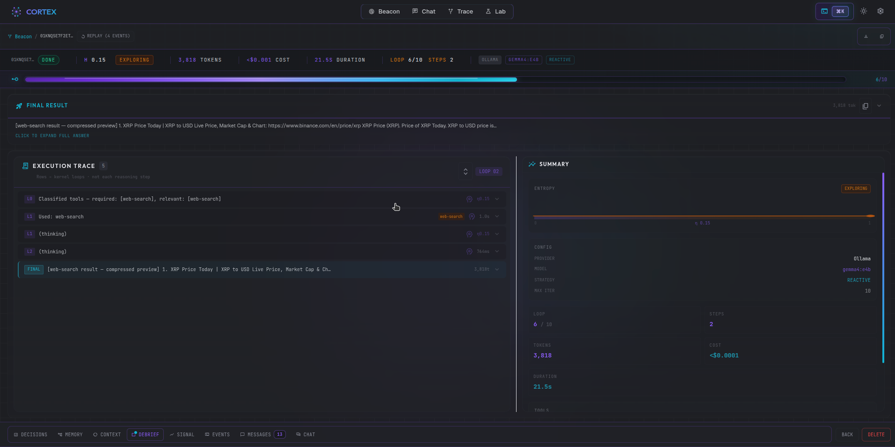
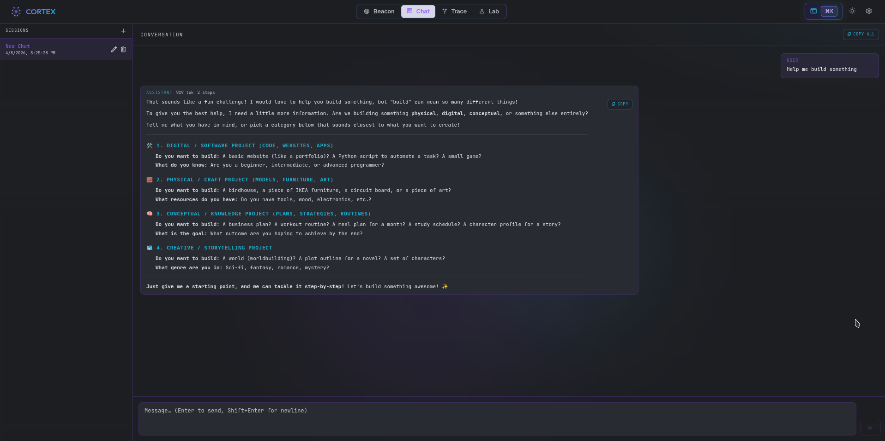

import { Tabs, TabItem, Aside, Card, CardGrid } from "@astrojs/starlight/components";

**Cortex** is the official local-first companion studio for Reactive Agents. Fire it up alongside any agent run and get an instant GUI — live reasoning traces, entropy signal charts, token/cost vitals, debrief summaries, a full trace panel, and an interactive chat interface — all persisted to SQLite so you can replay any run at any time.


## Quick Start

Start Cortex with one command, then connect any agent with one line:

<Tabs>
  <TabItem label="rax CLI (recommended)">
```bash
# Terminal 1 — start Cortex studio
rax cortex --dev
# → API on http://localhost:4321
# → UI  on http://localhost:5173

# Terminal 2 — run an agent that streams to Cortex

rax run "Research the top 5 TypeScript testing frameworks" \
 --provider anthropic \
 --reasoning \
 --tools \
 --cortex

````
  </TabItem>
  <TabItem label="From apps/cortex">
```bash
# from apps/cortex (also starts UI on :5173)
cd apps/cortex && bun start
````

Then connect any agent from code:

```typescript
import { ReactiveAgents } from 'reactive-agents'

const agent = await ReactiveAgents.create()
    .withProvider('anthropic')
    .withReasoning()
    .withTools()
    .withCortex() // ← streams all events to http://localhost:4321
    .build()

await agent.run('Research AI agent frameworks')
```

  </TabItem>
</Tabs>

Open **http://localhost:5173** — Cortex opens automatically as soon as your agent starts.

---

## Views

Cortex has five views accessible from the top navigation bar:

### Beacon — Live Agent Grid

The Beacon view is your **agent command center**: a live grid that shows every connected agent's cognitive state in real time, updated via WebSocket as events stream in.


**Cognitive state labels** map to entropy scores from the Reactive Intelligence layer:

| State       | Meaning                                            |
| ----------- | -------------------------------------------------- |
| `running`   | Agent is actively executing — standard entropy     |
| `exploring` | Diverging entropy — agent is broadening its search |
| `stressed`  | High entropy — agent may be stuck or looping       |
| `completed` | Run finished successfully                          |
| `error`     | Run ended with an unhandled error                  |
| `idle`      | Agent is connected but not currently running       |

The filter bar (`All`, `Running`, `Exploring`, `Stressed`, …) lets you focus on agents of interest. The **bottom input bar** submits a new prompt via `POST /api/runs` and navigates directly to the new run on success.

---

### Run View — Deep Inspection

Navigate to any run from the Beacon grid or the Runs list. The Run View is the core diagnostic surface in Cortex: a multi-panel interface combining real-time streaming and persistent replay.



#### Vitals Strip

Always-visible run metadata: iteration count, total duration, tokens used, estimated cost, LLM provider, model, and reasoning strategy selected.

#### Entropy Signal Monitor

A D3-powered chart tracking the composite entropy score across all iterations. Entropy encodes reasoning quality — a converging trace (`↘`) indicates healthy progress toward an answer; a flat or diverging trace flags loops or confusion. The chart updates live while the run is in progress, and is fully replayable from history.

#### Trace Panel

Step-by-step breakdown of the agent's reasoning loop, rendered as collapsible iteration frames:

-   **Thought** — what the agent decided to do and why
-   **Action** — the tool call issued (name + arguments)
-   **Observation** — the tool result returned

Each frame is time-stamped and indexed so you can trace exactly which tool call led to which reasoning step, and how long each took.

#### Bottom Tabs

| Tab            | Content                                                                                                                |
| -------------- | ---------------------------------------------------------------------------------------------------------------------- |
| **Debrief**    | Structured post-run summary: task, plan, outcome, sources, confidence, and self-critique                               |
| **Decisions**  | Controller decision log — each Reactive Intelligence intervention: early-stop, strategy-switch, context-compress, etc. |
| **Memory**     | Memory entries read and written during this run (working, semantic, episodic, procedural)                              |
| **Context**    | Full context window snapshot at each iteration                                                                         |
| **Raw Events** | All persisted `AgentEvent` objects with timestamps — the ground truth log                                              |
| **Chat**       | Open a follow-up conversation with the same agent using this run as context                                            |

<Aside type="tip">
Cortex supports **replay**: close the run, reopen it later, and the Trace Panel and Signal Monitor re-populate from the SQLite event log. Live streaming resumes automatically if the agent is still running.
</Aside>

---

### Chat — Interactive Sessions

The Chat view provides a conversational interface for multi-turn dialogue with any agent. Sessions are listed in the left panel; each session preserves the full conversation history.



Chat sessions are powered by `@reactive-agents/svelte` under the hood — the same `createCortexAgentRun` primitive that you can use in your own Svelte frontend.

---

### Lab — Builder, Skills, Tools, and Gateway

The Lab view is the **workshop** for configuring and launching agents directly from the Cortex UI without writing code:


| Tab         | Purpose                                                                                                                            |
| ----------- | ---------------------------------------------------------------------------------------------------------------------------------- |
| **Builder** | Visual agent configurator — choose provider, model, capabilities, and submit a prompt. Runs are immediately tracked in Beacon.     |
| **Gateway** | Manage persistent gateway agents: list all saved agents, see their status, last run time, and schedule. Start/stop on demand.      |
| **Skills**  | Browse all `SKILL.md` files discovered in the workspace and stored in SQLite. View skill content, metadata, and evolution history. |
| **Tools**   | Workshop for testing individual tools — invoke any registered tool with custom parameters and inspect the result.                  |

---

### Settings

Configure global Cortex defaults:

-   **Default provider and model** — used as the pre-fill in the Lab Builder
-   **Ollama endpoint** — custom local Ollama server URL
-   **UI theme** — light / dark / system
-   **Notifications** — enable / disable toast notifications
-   **Storage** — view current SQLite path and database size

---

## Connecting Your Agent

### `.withCortex()` Builder Method

```typescript
const agent = await ReactiveAgents.create()
    .withProvider('anthropic')
    .withModel('claude-sonnet-4-20250514')
    .withReasoning({ strategy: 'plan-execute' })
    .withTools()
    .withCortex() // ← connects to http://localhost:4321
    .withCortex('http://my-cortex:4321') // ← or explicit URL
    .build()
```

**URL resolution priority:**

1. Explicit URL passed to `.withCortex(url)`
2. `CORTEX_URL` environment variable
3. Default: `http://localhost:4321`

The connection is **best-effort** — if Cortex is not running or the WebSocket drops, the agent continues executing normally and logs a single warning. Cortex never blocks or slows down agent execution.

### What Gets Streamed

Every `AgentEvent` emitted on the internal EventBus is forwarded to Cortex over WebSocket at `/ws/ingest`. This includes:

| Event                            | What It Represents                                    |
| -------------------------------- | ----------------------------------------------------- |
| `AgentStarted`                   | Run begins — registers the agent in Beacon            |
| `AgentCompleted` / `AgentFailed` | Run ends — final status + cost                        |
| `ReasoningStepCompleted`         | One thought/action/observation triplet                |
| `ToolCallCompleted`              | Individual tool result with success/failure           |
| `FinalAnswerProduced`            | The agent's answer                                    |
| `LLMRequestCompleted`            | Token usage + cost per LLM call                       |
| `DebriefCompleted`               | Post-run structured summary                           |
| `EntropyScored`                  | Reactive Intelligence entropy measurement             |
| `ControllerDecision`             | Reactive Intelligence intervention (early-stop, etc.) |
| `ChatTurn`                       | Chat session message                                  |
| `MemoryRead` / `MemoryWrite`     | Memory layer activity                                 |
| `ProviderFallbackActivated`      | Provider fallback triggered                           |

### Environment Variables

| Variable                 | Default                 | Purpose                                                      |
| ------------------------ | ----------------------- | ------------------------------------------------------------ |
| `CORTEX_PORT`            | `4321`                  | Cortex server listen port                                    |
| `CORTEX_URL`             | `http://localhost:4321` | Base URL used by `.withCortex()` if not passed explicitly    |
| `CORTEX_NO_OPEN`         | unset                   | Set to `1` to prevent opening a browser on server start      |
| `CORTEX_LOG`             | `info`                  | Server log verbosity: `error` \| `warn` \| `info` \| `debug` |
| `CORTEX_SKILL_SCAN_ROOT` | —                       | Extra root path to scan for `SKILL.md` files in Lab/Skills   |

---

## rax CLI Integration

<Tabs>
  <TabItem label="Start Cortex">
```bash
# Start studio with hot-reloading UI (recommended during development)
rax cortex --dev

# Start API only (serves static bundle if built)

rax cortex

# Custom port

rax cortex --dev --port 4444

# Suppress browser auto-open

rax cortex --dev --no-open

````
  </TabItem>
  <TabItem label="Run with Cortex">
```bash
# Connect a one-off run to Cortex
rax run "Summarize the top AI news" \
  --provider anthropic \
  --reasoning \
  --tools \
  --cortex

# Custom Cortex URL
CORTEX_URL=http://cortex.internal:4321 \
  rax run "Task" --cortex --provider anthropic

# Stream output to terminal AND trace in Cortex simultaneously
rax run "Write tests for my auth module" \
  --provider anthropic \
  --reasoning \
  --tools \
  --stream \
  --cortex
````

  </TabItem>
</Tabs>

---

## Architecture

Cortex is a standalone application that runs alongside your agent process. It has no dependencies on the agent's runtime — communication is purely over WebSocket.

```
Your Agent Process                   Cortex Server (port 4321)
─────────────────────                ────────────────────────────
ReactiveAgentBuilder                 server/index.ts
  .withCortex()                        ├── /ws/ingest   ← receives events
      │                                │     └── CortexIngestService
      │  WebSocket (best-effort)        │           └── persists to SQLite
      └────────────────────────────────►│     └── EventBridge.broadcast()
                                       │                │
                                       ├── /ws/live/:agentId  ← fans out to UI
                                       │         ▲
                                       │         └── Browser (SvelteKit UI)
                                       │                http://localhost:5173
                                       └── /api/runs   ← REST history
```

**Server stack:** Bun + Elysia + `bun:sqlite`  
**UI stack:** SvelteKit 2, Svelte 5 (runes), Tailwind CSS, D3 for signal charts  
**Persistence:** SQLite at `.cortex/cortex.db` relative to the server process cwd

The live WebSocket at `/ws/live/:agentId` supports **replay**: on connection, the server immediately replays all persisted events for the requested `runId`, so the UI refreshes correctly even after a page reload.

---

## Integration with Web Framework Hooks

Because Cortex dogfoods `@reactive-agents/svelte`, you can use the same primitives in your own Svelte app:

```typescript
import { createCortexAgentRun } from '@reactive-agents/svelte'

const agentRun = createCortexAgentRun({
    cortexUrl: 'http://localhost:4321',
    agentId: 'my-agent',
})

// Reactive Svelte store: $agentRun.status, $agentRun.output, $agentRun.iterations
```

The same pattern is available for React (`@reactive-agents/react`) and Vue (`@reactive-agents/vue`).

---

## Production Use

Cortex is designed for local development and internal tooling. For production deployments:

-   Run `bun run build:ui` inside `apps/cortex` to build the static SvelteKit bundle into `ui/build`
-   The Cortex server serves the static bundle when `CORTEX_STATIC_PATH` points to `ui/build`
-   Secure the WebSocket endpoints and REST API behind your internal network — Cortex has no authentication by default

```bash
# Build the UI for self-hosted deployment
cd apps/cortex
bun run build:ui
bun run dev:server
# → Serves static UI + API on http://localhost:4321
```

---

## Related

-   [Observability](/features/observability/) — terminal-based metrics and tracing that Cortex complements
-   [Reactive Intelligence](/features/reactive-intelligence/) — the entropy signals visualized in the Signal Monitor
-   [Rax CLI Reference](/reference/cli/#rax-cortex) — full `rax cortex` flag reference
-   [Builder API Reference](/reference/builder-api/#optional-features) — `.withCortex(url?)` signature
